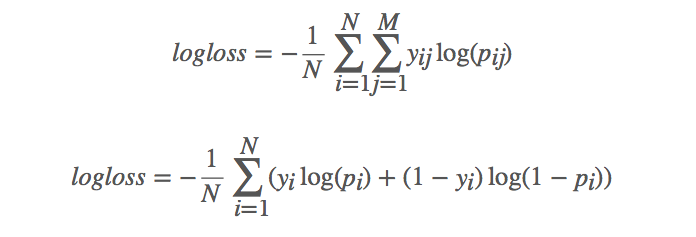

# Kobe Bryant Shot Selection

**Goal**: Predict the probability that a shot went in using *only events that happened prior to the shot*.

**Data**: *[Kobe Bryant Shot Selection](https://www.kaggle.com/c/kobe-bryant-shot-selection/data)* from Kaggle

**Model Setup**: Treating this as an online prediction problem

Four methods: 
1. Constant probability (baseline) 
2. Bayesian (multi-arm bandit) 
3. Warm start (e.g. SGD logistic regression, naive bayes) 
4. Cold start every time (i.e. build a new model for each shot that we are predicting)

**Evaluation**: log loss

From [Kaggle wiki](https://www.kaggle.com/wiki/LogarithmicLoss):
> The use of log on the error provides extreme punishments for being both confident and wrong. In the worst possible case, a single prediction that something is definitely true (1) when it is actually false will add infinite to your error score and make every other entry pointless. In Kaggle competitions, predictions are bounded away from the extremes by a small value in order to prevent this.
